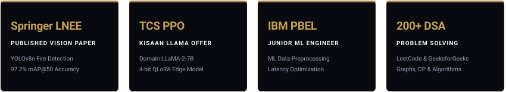
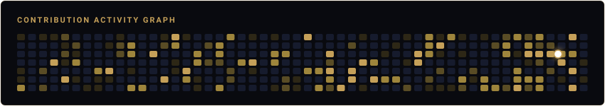

<p align="center">
  
</p>

I architect scalable machine learning systems and low-latency backend infrastructure. My work focuses on real-time computer vision engines, domain-adapted LLM fine-tuning and quantization, and resilient distributed task orchestration. Currently completing my B.Tech in AI & Machine Learning at PSIT Kanpur, I bring engineering experience from IBM and GeeksforGeeks alongside published research in peer-reviewed journals.

<br />

<p align="center">
  
</p>

### TECHNICAL CAPABILITIES

<p align="center">
  <!-- Languages -->
  
  
  
  
  
  
  <br />
  <!-- AI & Machine Learning -->
  
  
  
  
  
  
  
  
  <br />
  <!-- Backend & Databases -->
  
  
  
  
  
  
  
  
  <br />
  <!-- Tools & Infrastructure -->
  
  
  
  
  
  
</p>

<br />

<p align="center">
  
</p>

### SELECTED WORK

```
01 / KISAAN LLAMA
```
> **Pre-Placement Offer (PPO) Project at TCS**  
> Domain-adapted **LLaMA-2-7B** agricultural intelligence engine engineered with 4-bit **QLoRA** quantization for low-latency inference on edge and resource-constrained hardware. Features custom prompt formatting and lightweight parameter-efficient fine-tuning checkpoints.  
> **Tech Stack:** `Python` · `LLaMA-2-7B` · `PEFT / QLoRA` · `BitsAndBytes` · `PyTorch` · `Replicate API`  
> **Links:** [Repository](https://github.com/Ayushkhar/llama_kissan-new)

<br />

```
02 / QUEUECTL
```
> **Distributed Background Task Queue & CLI Engine**  
> High-throughput worker orchestration system designed with **SQLite Write-Ahead Logging (WAL)** for lock-free state persistence, exponential backoff retries, and dead-letter queue (DLQ) fault handling. Includes a dedicated live web monitoring dashboard.  
> **Tech Stack:** `TypeScript` · `Node.js` · `SQLite (WAL)` · `Docker` · `Vitest` · `CLI`  
> **Links:** [Live Dashboard](https://queuectl.suryanshkhare.online/) · [Video Architecture Demo](https://www.loom.com/share/922691c04da94450aded753bd0e673ec) · [Repository](https://github.com/Ayushkhar/FLAM-CLI-INTERFACE)

<br />

```
03 / PREPOS PLATFORM
```
> **Adaptive Academic Intelligence System**  
> Production study platform converting raw syllabi and PYQs into dynamic roadmaps and real-time doubt resolution flows via 70B parameter LLM inference and full-duplex WebSocket connections. Deployed with 24/7 high availability.  
> **Tech Stack:** `JavaScript` · `Node.js` · `Socket.IO` · `Groq (LLaMA 3.3 70B)` · `MongoDB` · `Cloudinary`  
> **Links:** [Live Platform](https://prep-os-live.onrender.com) · [Repository](https://github.com/Ayushkhar/Prep_os-Live)

<br />

```
04 / REAL-TIME FIRE DETECTION
```
> **Published Research Implementation (Springer LNEE)**  
> Edge vision detection pipeline using a custom-tuned **YOLOv8n** architecture trained on 1,700 annotated frames, achieving **97.2% mAP@50**. Incorporates dynamic ambient lighting suppression (distinguishing fire from sunlight/halogen glare) and real-time audio-visual alert triggers.  
> **Tech Stack:** `Python` · `YOLOv8n` · `PyTorch` · `OpenCV` · `Flask` · `Docker`  
> **Links:** [Repository](https://github.com/Ayushkhar/Fire-Detection-using-YOLO-v8n-Tweaked-RES-)

<br />

<p align="center">
  
</p>

### PROOF & CREDENTIALS

<p align="center">
  
</p>

#### Peer-Reviewed Publications
- **Springer LNEE (Lecture Notes in Electrical Engineering):** *Enhanced Real-Time Fire & Smoke Detection via Tweaked YOLOv8 Architecture* (97.2% mAP@50 performance on custom annotated benchmark dataset).
- **Medical Imaging Research:** *Early Alzheimer’s & Brain Pathology Diagnosis via PET Scan Signal Processing*.

#### Industry & Honors
- **Tata Consultancy Services (TCS):** Received Pre-Placement Offer (PPO) following technical evaluation of the *Kisaan Llama* quantized model architecture.
- **IBM (PBEL Program) — Junior ML Engineer:** Built automated backend ML data preprocessing pipelines and optimized inference latency for large-scale tabular/time-series workflows.
- **GeeksforGeeks — ML Analyst Intern:** Engineered predictive traffic-flow modeling systems and optimized algorithmic data processing scripts.

#### Algorithmic Proficiency
- **200+ Verified DSA Problems:** Solved across LeetCode & GeeksforGeeks with a focus on graph algorithms, dynamic programming, and memory-efficient data structures.

<br />

<p align="center">
  
</p>

### CONTRIBUTION ACTIVITY

<p align="center">
  
</p>

<br />

<p align="center">
  
</p>

### CONTACT

<p align="center">
  <sub>SURYANSH KHARE — KANPUR, INDIA</sub><br />
  <a href="https://github.com/Ayushkhar"><b>GitHub</b></a> &nbsp;&mdash;&nbsp;
  <a href="https://linkedin.com/in/suryansh-khare"><b>LinkedIn</b></a> &nbsp;&mdash;&nbsp;
  <a href="mailto:suryanshkhare.dev@gmail.com"><b>Email</b></a>
</p>
